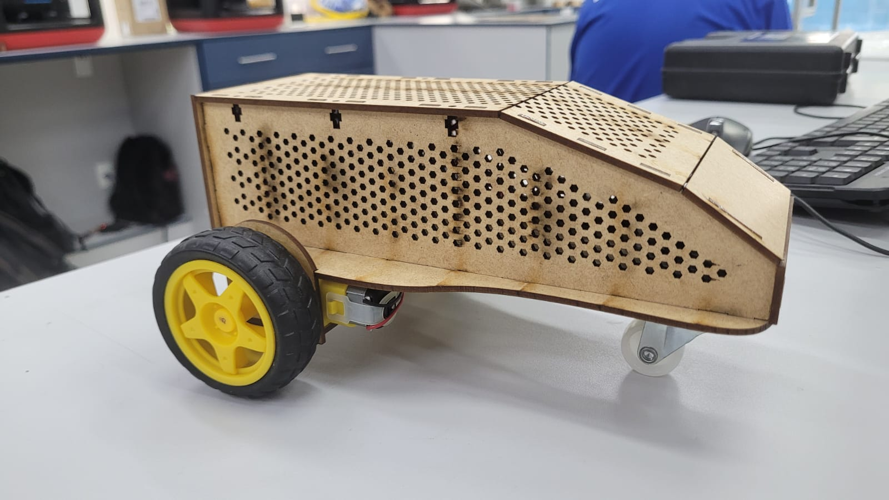

# Robô seguidor de linha com atmega328p

## Introdução

Este projeto consiste em um robô seguidor de linha construído utilizando um microcontrolador ATmega328P. O objetivo principal é desenvolver um veículo autônomo capaz de seguir uma linha preta em uma superfície branca, utilizando sensores infravermelhos para detecção da linha e motores para sua movimentação.

## Componentes Utilizados

A lista detalhada de componentes e esquemáticos pode ser encontrada no arquivo `Documentação Carrinho.pdf`, localizado na raiz do projeto. Os principais componentes incluem:

* Microcontrolador ATmega328P (comumente encontrado em placas Arduino Uno)
* Sensores infravermelhos (como o TCRT5000 ou similar) para detecção de linha
* Motores DC com caixa de redução
* Ponte H (como o L298N ou similar) para controle dos motores
* Rodas e chassi para a estrutura do robô
* Bateria ou fonte de alimentação

## Montagem

Instruções detalhadas de montagem, incluindo diagramas e possivelmente fotos do processo, estão disponíveis no arquivo `Documentação Carrinho.pdf`.

## Funcionamento do Código (`Codigo/codigoCarrinho.ino`)

O código do robô, escrito em C/C++ para a plataforma Arduino/ATmega328P, implementa a lógica para leitura dos sensores e controle dos motores.

### Pinos Utilizados:
* `sensorEsq`: A4 (Sensor infravermelho esquerdo)
* `sensorCentro`: A2 (Sensor infravermelho central)
* `sensorDir`: A0 (Sensor infravermelho direito)
* `motorEsq`: 10 (Controle do motor esquerdo via PWM)
* `motorDir`: 11 (Controle do motor direito via PWM)

### Lógica Principal (`loop()`):

1.  **Leitura dos Sensores**: Em cada ciclo do loop, o robô lê o estado dos três sensores infravermelhos.
    *   `digitalRead(sensor)` retorna `HIGH` (1) quando o sensor está sobre uma superfície clara (reflete luz) e `LOW` (0) quando está sobre uma superfície escura (absorve luz). Assumindo uma linha preta em fundo branco.

2.  **Tomada de Decisão**:
    *   **Reto**: Se o sensor central detecta a linha (`vCen == 0`) e os sensores laterais estão fora da linha (`vEsq == 1` e `vDir == 1`), o robô se move para frente (`reto()`).
    *   **Parar**: Se todos os sensores estão fora da linha (`vEsq == 1`, `vCen == 1`, `vDir == 1`) ou todos detectam a linha ( situação não usual, mas pode indicar um cruzamento ou o fim da linha, dependendo da configuração), o robô para (`parar()`). A condição no código é `vEsq == vCen && vCen == vDir`, o que na prática significa todos iguais (todos 0 ou todos 1).
    *   **Curva à Esquerda**: Se o sensor esquerdo detecta a linha (`vEsq == 0`) e o direito não (`vDir == 1`), o robô vira para a esquerda (`esquerda()`). O motor direito é acionado e o esquerdo parado/reduzido.
    *   **Curva à Direita**: Se o sensor direito detecta a linha (`vDir == 0`) e o esquerdo não (`vEsq == 1`), o robô vira para a direita (`direita()`). O motor esquerdo é acionado e o direito parado/reduzido.

### Funções de Movimento:
*   `reto()`: Ambos os motores são acionados com velocidade `200` (valor PWM).
*   `parar()`: Ambos os motores são parados (velocidade `0`).
*   `esquerda()`: Motor esquerdo parado, motor direito com velocidade `200`.
*   `direita()`: Motor direito parado, motor esquerdo com velocidade `200`.

## Instruções de Uso

1.  **Hardware**: Monte o robô conforme especificado na documentação (`Documentação Carrinho.pdf`).
2.  **Software**:
    *   Abra o arquivo `Codigo/codigoCarrinho.ino` na IDE do Arduino.
    *   Selecione a placa correta (Arduino Uno ou ATmega328P).
    *   Selecione a porta serial correta.
    *   Compile e carregue o código para o microcontrolador.
3.  **Execução**:
    *   Coloque o robô sobre uma pista com uma linha preta em fundo branco.
    *   Ligue a alimentação do robô.
    *   O robô deverá começar a seguir a linha.

## Apresentação Final

*Nota: A imagem acima é um GIF animado da apresentação.*
